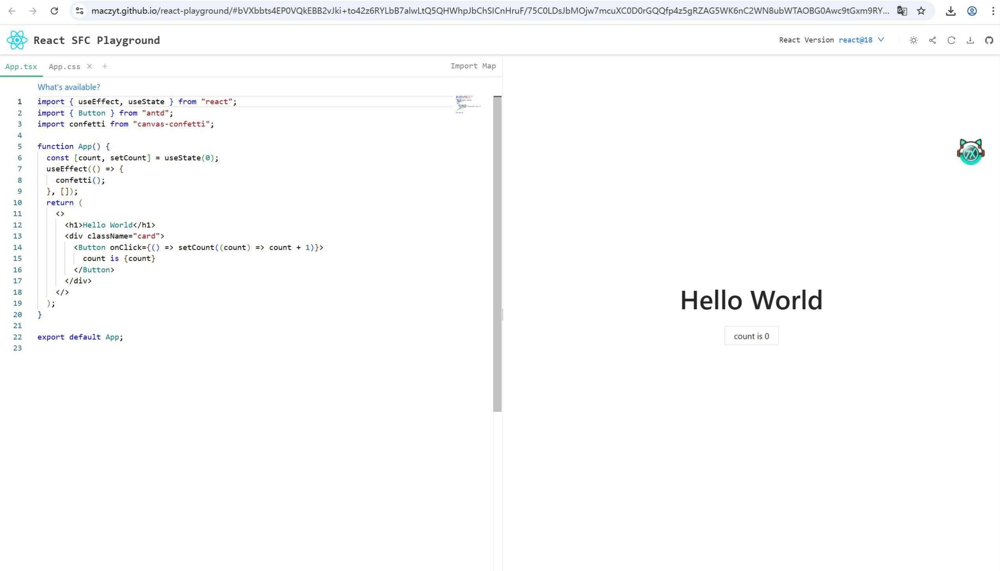
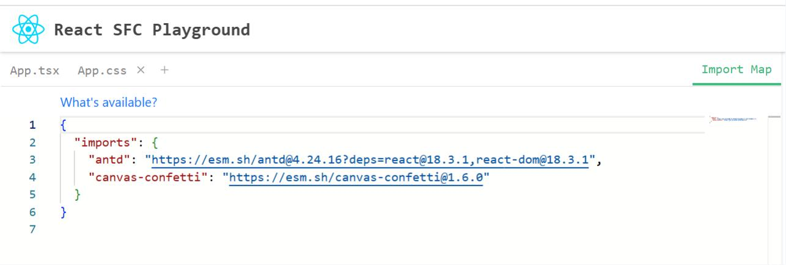
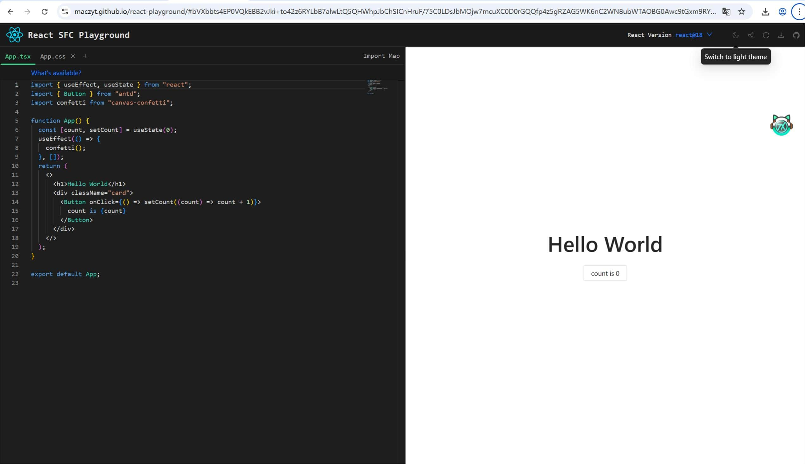

# react playground

本项目理论上适用任何支持 `es` 方式的 `react` 组件库引入作为 `playground`.

## 主页

## 依赖配置

> esm importmap, 查看[MDN 文档](https://developer.mozilla.org/zh-CN/docs/Web/HTML/Reference/Elements/script/type/importmap)

## Share Code

任何代码都不能保证没有 `bug`, 当使用方遇到了一个问题，在反馈该问题的时候，很多时候需要提供一堆配置代码，让组件库维护者能够最小复现，这要求使用方上传代码，维护者下载代码、安装依赖、运行代码才能复现。而 `playground` 提供了非常便捷的方式，使用方只需要把代码编辑在线上，并把该链接分享出去，这样维护者只需要打开该 `url`，便能查看到效果.

## Light/Dark theme

## 感谢

> 在开发的过程中，参考了下面，为我提供了非常大的帮助，非常感谢

- [Vue SFC Playground](https://play.vuejs.org/)
- [react-exercise-playground](https://github.com/fewismuch/react-playground)
